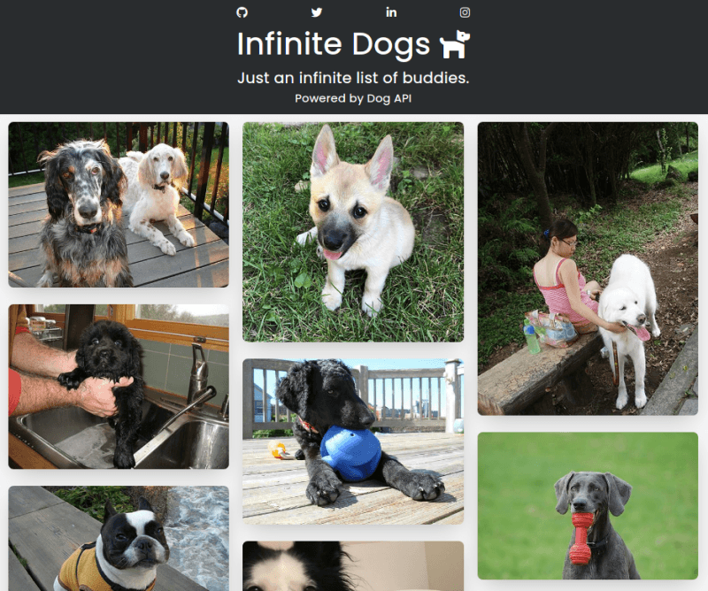

# Infinite Dogs 🐶

This is a simple JavaScript app that uses the [Dog API](https://dog.ceo/dog-api/) to fetch random Dog images.

## Screenshot

## Prerequisites

There are no prerequisites. Just browse the URL and have some fun!

## Using Infinite Dogs

Just browse to: <https://infinitedogs.guinuxbr.com>

## Contributing to Infinite Dogs

To contribute to infinite-dogs, follow these steps:

1. Fork this repository.
2. Create a branch: `git checkout -b <branch_name>`.
3. Make your changes and commit them: `git commit -m '<commit_message>'`
4. Push to the original branch: `git push origin infinite-dogs/<location>`
5. Create the pull request.

Alternatively, see the GitHub documentation on [creating a pull request](https://help.github.com/en/github/collaborating-with-issues-and-pull-requests/creating-a-pull-request).

## Maintainer & Contributors

* [@guinuxbr](https://github.com/guinuxbr)

## Contact

If you want to contact me you can email <guinuxbr@gmail.com>.

## Licence

This project uses the following licence: [GNU GPLv3](https://www.gnu.org/licenses/gpl-3.0.html).
